<p align="center">
  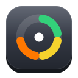
</p>

<h1 align="center">QuotaGlance</h1>

<p align="center">
  <b>Your AI coding quotas at a glance, natively on GNOME.</b><br>
  Session, weekly and monthly limits for Claude Code, Codex, Cursor, Copilot, Gemini CLI, Kiro,
  OpenCode, ElevenLabs and 21 more, with reset countdowns, in your top bar and on your desktop.
</p>

<p align="center">
  <a href="https://github.com/rafay-ah/quotaglance/actions/workflows/ci.yml"></a>
  <a href="https://github.com/rafay-ah/quotaglance/releases/latest"></a>
  
  
  
  <a href="LICENSE"></a>
</p>

<p align="center">
  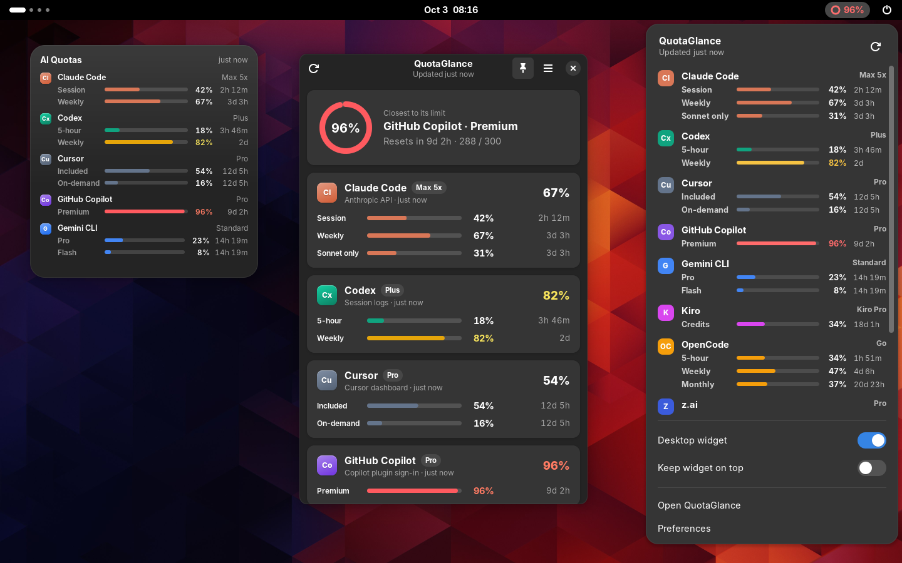
</p>

You use five AI tools a day and each one has its own limits: a 5-hour session window here, a
weekly cap there, monthly credits somewhere else. You find out you hit one in the middle of a
task. **QuotaGlance** puts all of them in one place, so you can see what's left and when it
resets before you start the long refactor.

## Highlights

- **Top-bar meter.** A ring in the top bar shows your busiest quota at a glance. Click it for a
  popup with every provider's session, weekly and monthly usage and reset countdowns.
- **Desktop widget.** A small, medium or large card in the spirit of macOS widgets, optionally
  tinted with your busiest provider's colour. Pin it on top of other windows, on every
  workspace.
- **Heads-up notifications** at 80% and 95% (each can be turned off), plus optional "limit reset"
  notices. Every alert fires once per window, even across restarts.
- **Starts on login**, quietly in the background, with a switch to turn that off.
- **Private by design.** QuotaGlance reads the sign-ins your tools already keep on this machine,
  read-only, and talks directly to each provider. API keys you add live in GNOME Keyring. It
  never asks for passwords, and there is no QuotaGlance server and no telemetry.
- **Native and light.** Python, GTK 4 and libadwaita: no Electron, no web views. It follows your
  light/dark style and accent colour and uses GNOME's own notifications and keyring.
- **29 providers**, each one toggleable: coding agents, editors, coding plans and API platforms.
  See [Supported providers](#supported-providers).

<p align="center">
  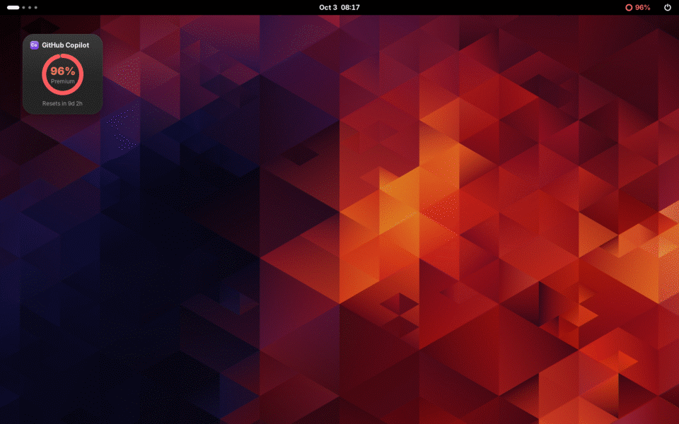
</p>

## Screenshots

<table>
  <tr>
    <td width="50%">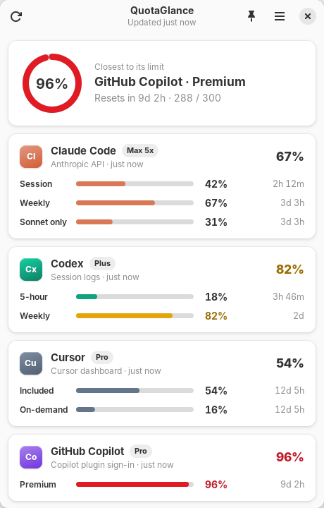</td>
    <td width="50%">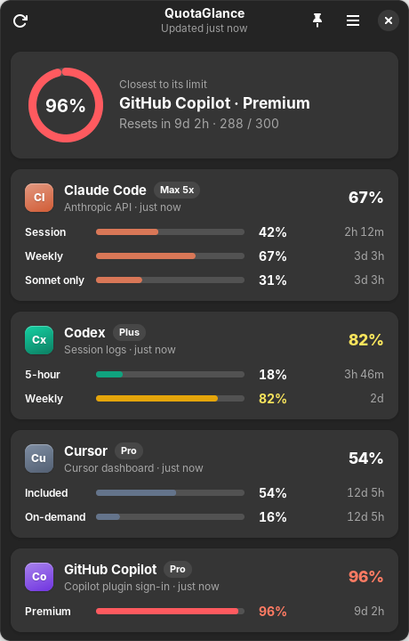</td>
  </tr>
  <tr>
    <td colspan="2">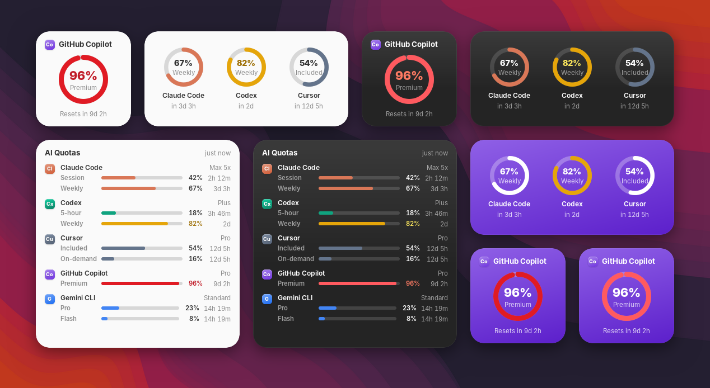</td>
  </tr>
  <tr>
    <td width="50%">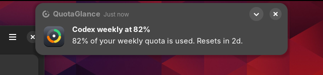<br>
      <sub>Notifications use GNOME's own notification system.</sub></td>
    <td width="50%">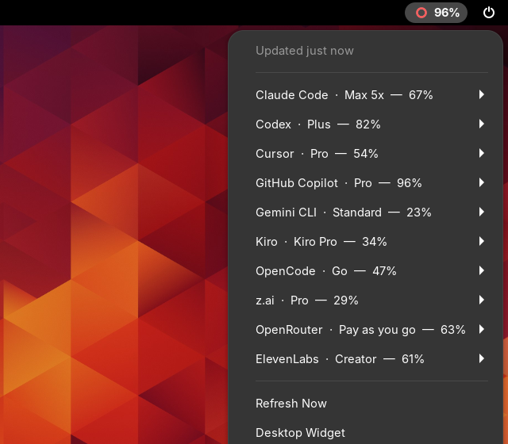<br>
      <sub>Without the extension, a tray icon works out of the box on Ubuntu.</sub></td>
  </tr>
  <tr>
    <td width="50%">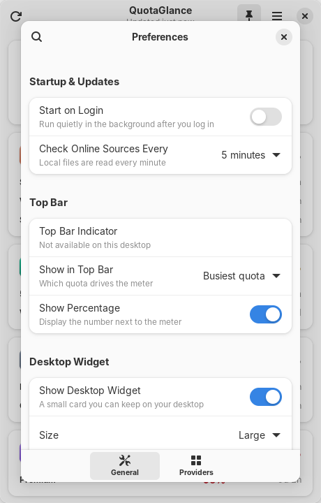</td>
    <td width="50%">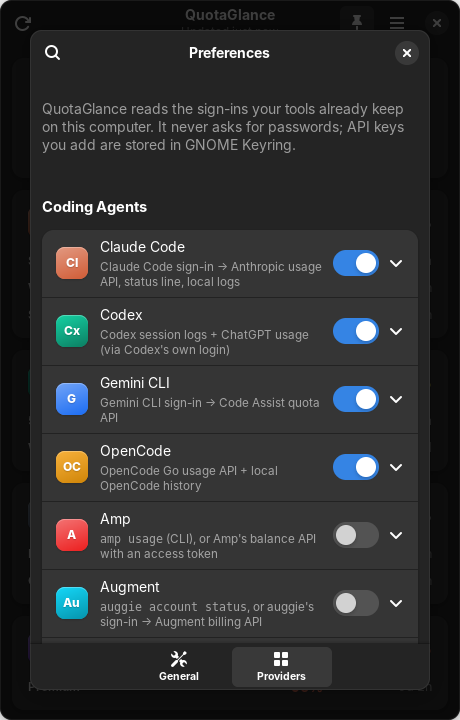</td>
  </tr>
</table>

All screenshots use the built-in [demo mode](#demo-mode) and real GNOME Shell 46.

## Install

QuotaGlance needs a GNOME desktop on **Ubuntu 24.04 or newer** (or any distribution with
GTK 4.12+, libadwaita 1.5+ and Python 3.10+). Download the latest build from the
[releases page](https://github.com/rafay-ah/quotaglance/releases/latest).

### Ubuntu and Debian (.deb)

```sh
sudo apt install ./quotaglance_*_all.deb
```

Then open **QuotaGlance** from the app grid. The package pulls in its dependencies
(`python3-gi`, `gir1.2-gtk-4.0`, `gir1.2-adw-1`, `gir1.2-secret-1`) and installs the GNOME Shell
extension system-wide.

### AppImage

```sh
chmod +x QuotaGlance-*-x86_64.AppImage
./QuotaGlance-*-x86_64.AppImage
```

The AppImage bundles Python, GTK 4 and libadwaita and runs on any distribution with glibc 2.39
or newer. On first run it adds itself to the app grid (`~/.local/share/applications`) so that
notifications, autostart and the top bar can find it. If your system lacks FUSE 2, run it with
`--appimage-extract-and-run`.

### From source

```sh
sudo apt install python3-gi python3-gi-cairo gir1.2-gtk-4.0 gir1.2-adw-1 gir1.2-secret-1
git clone https://github.com/rafay-ah/quotaglance.git
cd quotaglance
PYTHONPATH=src python3 -m quotaglance
```

## The top bar

There are two ways to show QuotaGlance in the top bar, and the app picks the best one
automatically:

1. **The QuotaGlance GNOME Shell extension** (recommended). This gives you the rich popup shown
   above, and it is what pins the desktop widget. The .deb installs it. To turn it on, open
   **Preferences → Top Bar → Install/Enable**, or run
   `gnome-extensions enable quotaglance@rafay-ah.github.io`. On Wayland, GNOME only discovers
   newly installed extensions at login, so **log out and back in once**.
2. **A tray icon** (StatusNotifierItem/AppIndicator). Ubuntu ships the AppIndicator extension
   enabled, so this works with no setup. It shows the same meter with a text menu. KDE Plasma and
   other desktops with a system tray show it too.

When the extension is active the tray icon hides itself, so you never see two meters.

## Supported providers

Turn providers on and off in **Preferences → Providers**. On first launch QuotaGlance switches on
every provider it finds signed in on this computer.

<!-- providers:start -->
| Provider | Category | Data source | Setup |
| --- | --- | --- | --- |
| [Amp](https://ampcode.com/settings) | Coding agents | `amp usage` (CLI), or Amp's balance API with an access token | Install the Amp CLI and run `amp login`, or paste an Amp access token in Preferences. |
| [Augment](https://app.augmentcode.com/account) | Coding agents | `auggie account status`, or auggie's sign-in → Augment billing API | Install the auggie CLI (npm install -g @augmentcode/auggie) and run `auggie login`. |
| [Claude Code](https://claude.ai/settings/usage) | Coding agents | Claude Code sign-in → Anthropic usage API, status line, local logs | Install Claude Code and sign in with your Claude subscription (run `claude`). |
| [Codebuff](https://www.codebuff.com/usage) | Coding agents | Codebuff CLI sign-in or API key → Codebuff usage API | Run `codebuff login`, or paste a Codebuff API key in Preferences. |
| [Codex](https://chatgpt.com/codex/settings/usage) | Coding agents | Codex session logs + ChatGPT usage (via Codex's own login) | Install the Codex CLI and sign in with ChatGPT (`codex login`). |
| [Factory Droid](https://app.factory.ai/settings/billing) | Coding agents | Factory billing API (API key) | Create an API key at app.factory.ai/settings/api-keys and paste it in Preferences, or set FACTORY_API_KEY. |
| [Gemini CLI](https://github.com/google-gemini/gemini-cli) | Coding agents | Gemini CLI sign-in → Code Assist quota API | Run `gemini` and sign in with a Code Assist Standard or Enterprise account. |
| [OpenCode](https://opencode.ai/auth) | Coding agents | OpenCode Go usage API + local OpenCode history | Sign in to OpenCode Go or Zen with `opencode auth login`; QuotaGlance reads OpenCode's saved key and history. |
| [Warp](https://app.warp.dev/settings/billing) | Coding agents | Warp request-limit API (personal API key) | Create a personal API key in Warp (Settings → Cloud platform → API keys) and paste it in Preferences. |
| [Antigravity](https://antigravity.google) | Editors & IDEs | Antigravity CLI (`agy`) usage report | Install the Antigravity CLI (1.1.11 or later) and run `agy` once to sign in with Google. |
| [Cline](https://app.cline.bot/dashboard) | Editors & IDEs | ClinePass usage API (Cline sign-in or API key) | Paste a Cline API key in Preferences (best for background updates), or run `cline auth`. |
| [Cursor](https://cursor.com/dashboard) | Editors & IDEs | Cursor app sign-in → Cursor usage dashboard | Install Cursor and sign in. QuotaGlance reuses that session (read-only). |
| [GitHub Copilot](https://github.com/settings/copilot) | Editors & IDEs | Editor or GitHub CLI sign-in → GitHub Copilot API | Sign in to Copilot in VS Code, JetBrains or Neovim, or run `gh auth login`. You can also paste a GitHub OAuth token in Preferences. |
| [JetBrains AI](https://www.jetbrains.com/ai/) | Editors & IDEs | Quota file written by your JetBrains IDE (local) | Use AI Assistant once in any JetBrains IDE; it then records its quota locally. |
| [Kilo Code](https://app.kilo.ai/profile) | Editors & IDEs | Kilo CLI sign-in or API token → Kilo usage API | Run `kilo auth login`, or paste a Kilo API token in Preferences. |
| [Kiro](https://app.kiro.dev/account/usage) | Editors & IDEs | kiro-cli /usage report + Kiro usage API | Install kiro-cli and run `kiro-cli login`, or sign in to the Kiro IDE. |
| [Windsurf](https://windsurf.com/subscription/usage) | Editors & IDEs | Windsurf app sign-in → Windsurf usage API (or the app's cache) | Install Windsurf and sign in. QuotaGlance reuses that session (read-only). |
| [Zed](https://zed.dev/account) | Editors & IDEs | Zed editor sign-in (GNOME Keyring) → Zed cloud API | Sign in from the Zed editor (command palette → “client: sign in”); QuotaGlance reads that sign-in from GNOME Keyring. |
| [Chutes](https://chutes.ai) | Coding plans & API platforms | Chutes subscription and quota API (API key) | Create an API key at chutes.ai (an admin key, or one allowed to read user info), and paste it in Preferences. |
| [DeepSeek](https://platform.deepseek.com/usage) | Coding plans & API platforms | DeepSeek balance API (API key) | Create an API key at platform.deepseek.com → API keys, and paste it in Preferences. |
| [Kimi Code](https://www.kimi.com/code/console) | Coding plans & API platforms | Kimi Code usage API (API key or Kimi Code CLI) | Create an API key in the Kimi Code console (kimi.com/code/console) and paste it in Preferences, or sign in with the `kimi` CLI. |
| [MiniMax](https://platform.minimax.io/user-center/payment/coding-plan?cycle_type=3) | Coding plans & API platforms | MiniMax Token Plan quota API (API key) | Copy your Token Plan key (sk-cp-…) from platform.minimax.io → Token Plan, and paste it in Preferences. |
| [Moonshot](https://platform.moonshot.ai/console/account) | Coding plans & API platforms | Moonshot / Kimi Open Platform balance API (API key) | Create an API key at platform.moonshot.ai (or platform.moonshot.cn) → API Keys, and paste it in Preferences. |
| [OpenRouter](https://openrouter.ai/settings/credits) | Coding plans & API platforms | OpenRouter key and credits API (API key) | Create an API key at openrouter.ai → Settings → API Keys, and paste it in Preferences. |
| [Poe](https://poe.com/api_key) | Coding plans & API platforms | Poe usage API (API key) | Copy your API key from poe.com/api_key, and paste it in Preferences. |
| [Synthetic](https://synthetic.new) | Coding plans & API platforms | Synthetic quotas API (API key) | Create an API key in your synthetic.new account (see dev.synthetic.new/docs/api/getting-started), and paste it in Preferences. |
| [Vercel AI Gateway](https://vercel.com/d?to=%2F%5Bteam%5D%2F%7E%2Fai-gateway) | Coding plans & API platforms | AI Gateway credits API (API key) | Create an API key in the Vercel dashboard → AI Gateway → API Keys, and paste it in Preferences. |
| [z.ai](https://z.ai/manage-apikey/coding-plan/personal/my-plan) | Coding plans & API platforms | GLM Coding Plan quota API (API key) | Paste your z.ai API key in Preferences, or sign in to z.ai in OpenCode. |
| [ElevenLabs](https://elevenlabs.io/app/subscription) | Voice & media | ElevenLabs subscription API (API key) | Create an API key with the User → Read permission at elevenlabs.io → Developers → API keys, and paste it in Preferences. |
<!-- providers:end -->

How the data is read, in short:

- **Local files first.** For example the Codex session logs, Cursor's and Windsurf's state
  databases, JetBrains' quota file and OpenCode's history are read directly, and never written.
- **The tool's own CLI** where it reports usage, such as `kiro-cli /usage`, `amp usage` and
  `agy /usage`.
- **The usage endpoint the tool itself calls**, authenticated with the sign-in it already saved,
  for example Claude Code's OAuth token or the Copilot plugins' GitHub token.
- **An API key you paste into Preferences** for API platforms. It is stored in GNOME Keyring;
  the usual environment variables (such as `ELEVENLABS_API_KEY`) work as well.

Tokens are **never refreshed or rewritten** when a refresh could rotate them and sign you out of
the original tool. If a sign-in has expired, QuotaGlance tells you to open that tool once.

### Claude Code and Codex in detail

Both have a **Data source** setting in Preferences → Providers.

- **Claude Code.** *Automatic* reads the usage endpoint Claude Code's `/usage` screen uses, at
  most every 5 minutes, with the sign-in Claude Code saved. Turn on **Status line bridge** to get
  the exact 5-hour and weekly numbers from Claude Code itself with no network calls at all:
  QuotaGlance wraps your status line (your own command keeps working, and switching it off
  restores it). *Local logs only* estimates usage from `~/.claude/projects` transcripts.
- **Codex.** The session logs in `~/.codex/sessions` already carry your limits after every turn,
  so they work offline. *Automatic* adds the ChatGPT usage endpoint (what `/status` shows) while
  Codex's token is fresh, and otherwise asks `codex app-server`, which renews its own login
  safely. Set **Codex home** if you use a custom `CODEX_HOME`.

> [!NOTE]
> Several providers have no public quota API, so QuotaGlance uses the same endpoints as their
> official apps and CLIs. They can change without notice. If a provider breaks, please
> [open an issue](https://github.com/rafay-ah/quotaglance/issues).

## Privacy and security

- QuotaGlance has **no backend and no telemetry**. Requests go straight from your computer to
  each provider, with the same credentials the provider's own tool uses.
- Other tools' credential files and databases are opened **read-only**. SQLite databases are
  opened so that not even lock files are created next to them.
- API keys you enter are stored in **GNOME Keyring** (libsecret) as "QuotaGlance: <provider> API
  key" items. You can inspect or delete them in *Passwords and Keys* (Seahorse).
- Settings live in `~/.config/quotaglance/config.json`; the last fetched numbers are cached in
  `~/.cache/quotaglance/` so the widget has something to show right after login.

## Command line

```text
quotaglance                 open the main window (starts the background service if needed)
quotaglance --background    start without a window (used for autostart)
quotaglance --widget        toggle the desktop widget
quotaglance --preferences   open Preferences
quotaglance --status        print current usage in the terminal and exit
quotaglance --json          print current usage as JSON and exit
quotaglance --demo          use realistic sample data
quotaglance --quit          quit the running instance
```

`--status` and `--json` do not need a display, so they are handy over SSH or in scripts:

```text
$ quotaglance --status
Claude Code  Max 5x
  Session             ███████░░░░░░░░░    42%  resets in 2h 13m
  Weekly              ███████████░░░░░    67%  resets in 3d 4h
```

## Demo mode

Run `quotaglance --demo` (or set `QUOTAGLANCE_DEMO=1`, or flip **Preferences → Demo**) to explore
everything with realistic mock data. The numbers drift upward while the app runs and windows roll
over at their reset time, so you can watch the meters, colours and notifications change.

## How it works

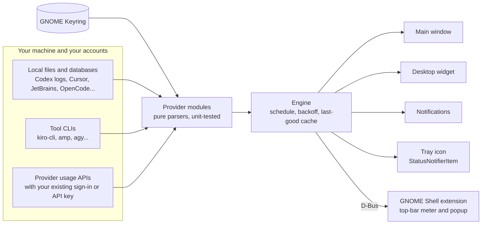

- `src/quotaglance/providers/` has one module per provider. Parsing lives in pure functions that
  are tested against recorded responses in `tests/fixtures/`.
- `src/quotaglance/engine.py` refreshes providers on a small thread pool: local sources every
  minute, network sources every 5 minutes by default, with exponential backoff on errors. When a
  fetch fails, the last good numbers stay visible, marked as stale.
- `src/quotaglance/gui/` is the GTK 4 / libadwaita app. It owns the session-bus name
  `io.github.rafay_ah.QuotaGlance` and exports the `io.github.rafay_ah.QuotaGlance1` interface
  the Shell extension reads.
- `extension/` is the GNOME Shell extension. It only reads from the app over D-Bus and never
  touches the network or any credentials.

## Development

```sh
# Run from the checkout
PYTHONPATH=src python3 -m quotaglance --demo

# Unit tests and lint (no GTK needed)
python3 -m pip install pytest ruff
python3 -m pytest
ruff check src tests scripts

# Pixel-exact screenshots of every surface (needs a display, e.g. weston --backend=headless)
python3 scripts/capture.py --out /tmp/shots --dark

# A throwaway headless GNOME Shell session with the extension, for end-to-end checks
scripts/shell-capture/run-shell.sh /tmp/shell dark extension

# Packages
packaging/deb/build-deb.sh dist
packaging/appimage/build-appimage.sh dist
```

### Adding a provider

1. Create `src/quotaglance/providers/<id>.py` with a `Provider` subclass: metadata (name,
   monogram, colour, category, where the data comes from), a cheap offline `detect()`, and a
   `fetch()` that returns a `ProviderSnapshot` of `UsageWindow`s.
2. Keep parsing in pure `parse_*` functions and add fixtures plus tests in
   `tests/test_<id>.py`; `tests/conftest.py` provides a fake HTTP client, fake home directory and
   fake CLI runner.
3. Register the class in `src/quotaglance/providers/__init__.py` and run
   `python3 scripts/provider_table.py` to refresh the table above.

Rules every provider follows: read other apps' files read-only, never refresh rotating tokens,
prefer local data, and turn every failure into a clear, actionable message.

## Troubleshooting

- **No top-bar icon.** Open Preferences → Top Bar. If it says the extension needs a re-login,
  log out and back in. On vanilla GNOME without the extension, there is no tray, so the
  extension is required there.
- **"Sign-in expired."** Open the tool in question once (for example run `claude`, `codex` or
  `gemini`) so it refreshes its own session; QuotaGlance picks it up on the next refresh.
- **A provider shows "Not set up".** Check its row in Preferences → Providers: it explains where
  QuotaGlance looked and what to do.
- **Debug logging:** `quotaglance --debug`, or `quotaglance --status` to test providers from a
  terminal.

## Credits

QuotaGlance was inspired by [CodexBar](https://github.com/steipete/CodexBar) for macOS, whose
open documentation of provider data sources was a great help. Thanks to the GNOME, GTK and
libadwaita projects for the platform.

## License

[MIT](LICENSE) © 2026 rafay-ah
